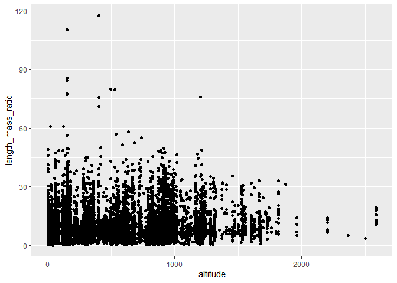
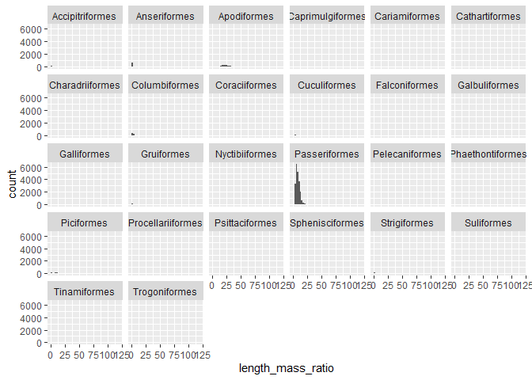
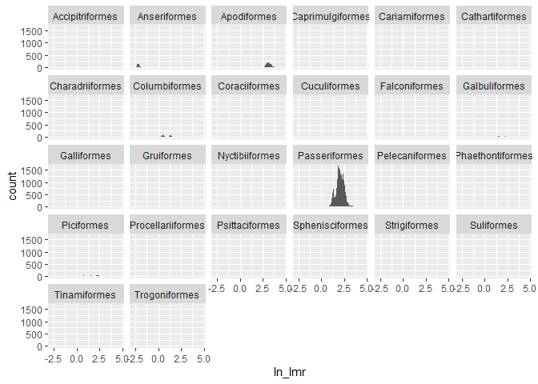
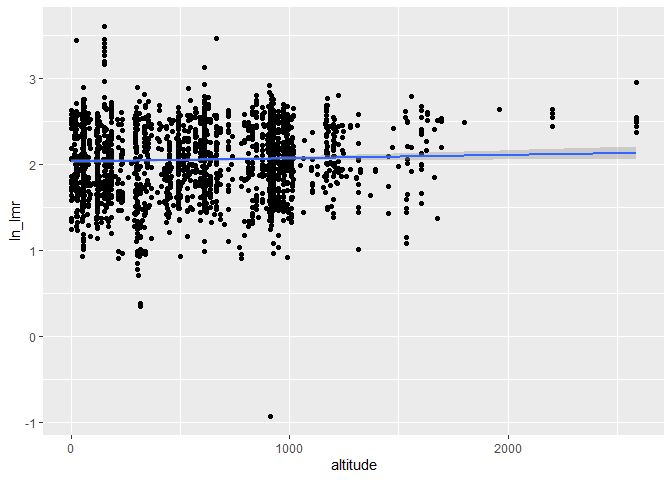
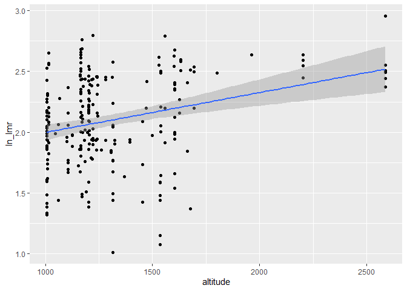

# Title

Casey Perkins, Bryn Rivenes

Dr. Chris Merkord

## Introduction

-   We decided to explore Allen’s rule: body surface-area-to-volume
    ratio for animals varies with the average temperature of a
    creature’s habitat.

-   We used data on birds fount in the Atlantic Forest of South America
    to explore the connection between altitude and length to mass ratios

    ")

## Methods

-   Our data came from The Atlantic Bird’s Data Set; a data set complied
    over decades by many scientists.

-   In bird data collection, birds are typically caught in a mist net

    

-   Then various measurements are taken. We are interested in the length
    to mass ratio

## Results

<!-- -->

Figure 1. We ran our mass to length ratio with altitude and found we had
very messy data

<!-- -->

<!-- -->

-   Here we noticed that our data were severely right skewed

<!-- -->

-   We corrected the skew in our data by taking the natural log of our
    data points

<!-- --><!-- -->

-   We plotted the mean lmr for each genus/species and saw a slight
    upward trend which intensified when we looked exclusivly at
    altitudes higher than 1000

    <!-- -->

-   We took the mean lmr of birds found over 1000 m and birds found
    under 1000 and found the means were different

-   The mean lmr of birds found above 1000 m = 7.9 while the mean lmr of
    birds found below 1000 m = 5.2. A Welch’s Two Sample t-test found
    t(76) = 3.6, p =0.0005.

## Discussion

-   Our analysis suggests that the greater the altitude a bird species
    is found at, the greater their mean lmr is.

-   This trend follows the trend seen in birds examined latitudinally as
    seen in many other research projects on birds.

-   Essentially, what we see is that birds that are fat and fluffy tend
    to live at higher elevations that birds that are long and skinny.

-   A possible explination for this is that birds that found in more
    extreme climates (higher elevations) are more adapted for their
    specific environment.

-   Allen’s rule suggest that any morphological trait (such as appendage
    thickness or hair length) should also vary based on temperature. A
    future analysis we would like to do is see if this trend holds true
    for other morphological bird characteristics.  

## References

-   Blackburn T, Ruggiero A. Latitude, elevation and body mass variation
    in Andean passerine birds. Global Ecology and Biography 2001 (cited
    2022 Feb 18); 10: 245-259.

-   Hasui, É., Metzger, J.P., Pimentel, R.G., Silveira, L.F., Bovo,
    A.A.d.A., Martensen, A.C., Uezu, A., Regolin, A.L., Bispo de
    Oliveira, A.Â., Gatto, C.A.F.R., Duca, C., Andretti, C.B.,
    Banks-Leite, C., Luz, D., Mariz, D., Alexandrino, E.R., de Barros,
    F.M., Martello, F., Pereira, I.M.d.S., da Silva, J.N., Ferraz,
    K.M.P.M.d.B., Naka, L.N., dos Anjos, L., Efe, M.A., Pizo, M.A.,
    Pichorim, M., Gonçalves, M.S.S., Cordeiro, P.H.C., Dias, R.A.,
    Muylaert, R.d.L., Rodrigues, R.C., da Costa, T.V.V., Cavarzere, V.,
    Tonetti, V.R., Silva, W.R., Jenkins, C.N., Galetti, M. and Ribeiro,
    M.C. (2018), ATLANTIC BIRDS: a data set of bird species from the
    Brazilian Atlantic Forest. Ecology, 99: 497-497.
    <https://doi.org/10.1002/ecy.2119>

-   Lamichhaney S, Han F, Berglund J, Wang C, Almén MS, Webster MT,
    Grant BR, Grant PR, Andersson L. A beak size locus in Darwin’s
    finches facilitated character displacement during a drought.
    Science. 2016 (cited 2022 Feb 18);352(6284):470-4

-   Landmann A, Winding N. Guild Organization and Morphology of
    High-Altitude Granivorous and Insectivorous Birds: Convergent
    Evolution in an Extreme Environment. Oikos. 2995 (cited 2022 Feb
    18);73(2):237-250.

-   Sun Y, Li M, Song G, Lei F, Li D, Wu Y. The Role of Climate Factors
    in Geographic Variation in Body Mass and Wing Length in a Passerine
    Bird. Avian Res. 2017 (cited 2022 Feb 19); 8, 1.

## Acknowledgments

-   We would like to thank the original authors of the Atlantic Birds
    Data Set and all of those who helped compile it through museum
    collections, online data bases, published sources, and unpublished
    reports, as well as the people out out in the field who originally
    collected this data.

-   We also would like to thank Dr. Merkord for his guidance with coding
    and data analyse.
